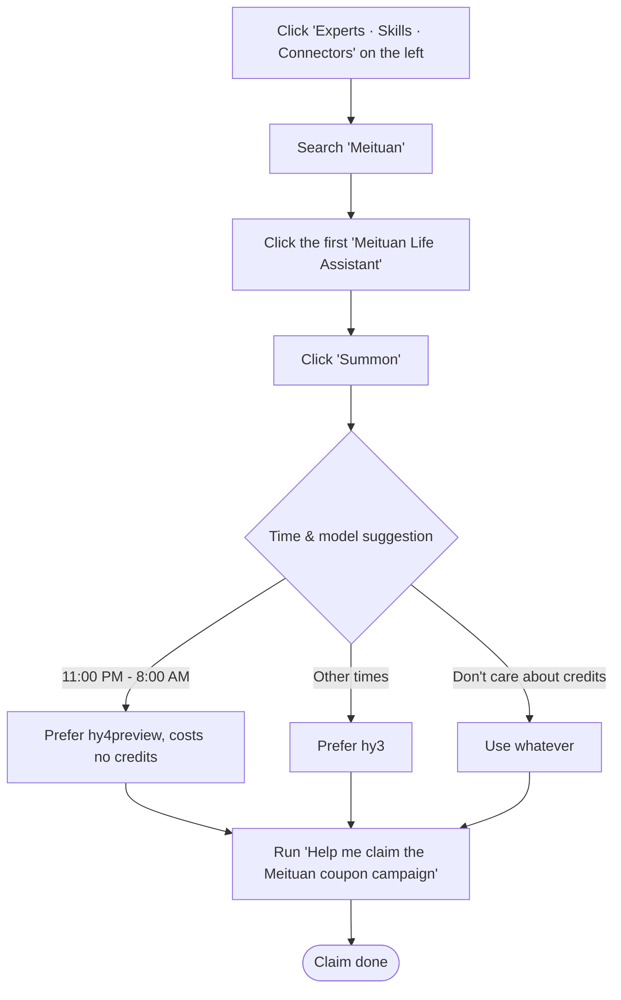

# workbuddy-meituan-daily-benefits-guide

English | [中文](README.md)

A step-by-step guide to registering WorkBuddy with a student invite, completing student verification, claiming Meituan coupons, and setting up **daily automatic Meituan red-packet collection** (plus a daily 100-credit check-in automation).

## 1. WorkBuddy registration

https://www.workbuddy.cn/events/invite?inviteCode=s4ey43des

Using this invite code grants **2000 credits**.


## 2. Student verification

https://www.workbuddy.cn/events/campus-freshman/

Open this page; a WeChat QR code appears. Scan it to enter the verification page.


### Path 1

If you have already done WeChat student verification before, verification proceeds directly; on success you receive **1000 credits**.

### Path 2

WeChat + CHSI / Alipay joint verification (for first-time or re-verification).

1. Enter the WeChat student verification page and fill in your own basic student info as required.
2. The page automatically redirects to **CHSI (China Higher Education Student Information Network, 学信网)**.
3. Log in, go to the **"Student Record (学信档案)"** section, and click **"Online Verification Report (在线验证报告)"**.


4. Find the **"MOE Online Verification Report of Student Status (教育部学籍在线验证报告)"** and click **"View (查看)"** on the right.


5. Select the matching in-study university info, then click **"View (查看)"** again.
6. The system completes verification and authorization; returning to WeChat finishes the basic student verification.


#### Verification flowchart

```mermaid
flowchart TD
    Start([Start: enter WeChat student verification]) --> Step1[Fill in basic student info]
    Step1 --> Step2[Redirect to CHSI login]

    subgraph GuideBox [CHSI workflow (an auto guide assistant is present throughout)]
        Step2 --> Step3[Enter Student Record]
        Step3 --> Step4[Click Online Verification Report]
        Step4 --> Step5[Click MOE Online Verification Report of Student Status and view]
        Step5 --> Step6[Select your school and click View]
        Step6 --> Step7[Complete WeChat basic student verification]
    end

    Step7 --> BackToWB[Return to WeChat WorkBuddy student verification page]

    BackToWB --> Choice{Choose verification method}

    Choice -- CHSI App installed on phone --> ModeA[CHSI verification]
    ModeA --> AuthA[Launch CHSI App quick authorization]

    Choice -- CHSI App not installed --> ModeB[Alipay verification]
    ModeB --> AuthB[Launch Alipay student verification<br/>+ Alipay CHSI plugin check]

    AuthA --> Success([Verified: claim 1000 credits])
    AuthB --> Success([Verified: claim 1000 credits])
```

## 3. Claim Meituan coupons


1. Click "Experts · Skills · Connectors" on the left.


2. Search for "Meituan" (美团).
2. Click the first result "Meituan Life Assistant" (美团生活助手).
3. Click "Summon" (召唤).
4. Run "Help me claim the Meituan coupon campaign" (帮我领美团优惠券活动).
(If it is currently 11:00 PM – 8:00 AM, prefer **hy4preview** which costs no credits; at other times prefer **hy3**; if you don't care about credits, use whatever.)



## 4. Set up daily automatic Meituan red-packet collection


1. Click "Scheduled Tasks" (定时任务).
2. Click "Add Scheduled Task" (添加定时任务).


3. The name can be "Meituan" or anything else — it does not affect the task.
4. The prompt must not be arbitrary; you can write "Help me claim the Meituan coupon campaign" (帮我领美团优惠券活动).
5. Click the **+** sign below the prompt.
6. Click "Expert" (专家).
7. Select "Meituan Life Assistant" (美团生活助手).


8. Set the execution frequency — daily is recommended; pick a time that suits your habit.
(Running between 11:00 PM – 8:00 AM is recommended, since **hy4preview** is free then.)

```mermaid
flowchart TD
    Step1[Click 'Scheduled Tasks' - 'Add Scheduled Task'] --> Step2[Set name: 'Meituan' or anything; does not affect the task]
    Step2 --> Step3[Fill prompt: not arbitrary; use 'Help me claim the Meituan coupon campaign']
    Step3 --> Step4[Click the + sign below the prompt]
    Step4 --> Step5[Click 'Expert']
    Step5 --> Step6[Select 'Meituan Life Assistant']
    Step6 --> Step7[Set frequency: daily recommended, time per your habit<br/>(11:00 PM - 8:00 AM recommended, hy4preview is free then)]
    Step7 --> End2([Setup done])
```

## 5. Daily 100-credit check-in automation

Just type into the input box: "Help me find on GitHub a project that lets WorkBuddy auto check-in every day, and set up a scheduled task to run it automatically" — or a similar prompt.

GitHub has many quality skills; this doc does not recommend specific ones and encourages you to find what fits your own needs.
