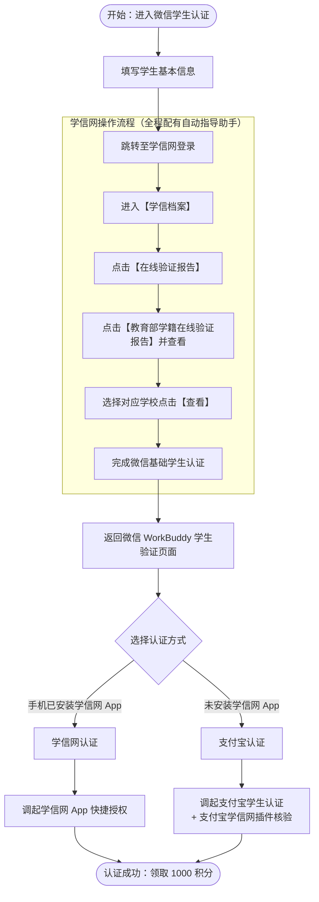

# workbuddy-meituan-daily-benefits-guide

## 1.workbuddy注册
https://www.workbuddy.cn/events/invite?inviteCode=s4ey43des

使用该邀请码可以获得2000积分

## 2.学生认证
https://www.workbuddy.cn/events/campus-freshman/

进入当前页面，会有微信二维码，扫描，进入认证页面

### 路径一
如果之前进行过微信学生认证，则认证可以直接进行，成功后收到1000积分

### 路径二 
微信与学信网/支付宝联合认证（适用于首次或重新认证）

#### 认证流程图

## 3.领取美团优惠券

点击左侧“专家·技能·连接器”

搜索“美团”，点击第一个“美团生活助手”，“召唤”，运行”帮我领美团优惠券活动“
若现在是晚上11：00-早上8:00，建议使用hy4preview，不扣积分，其他时间段建议使用hy3，不在意积分者随意）

## 4.设定每日自动领取美团红包自动化

点击“定时任务”-“添加定时任务”

名称可以设置为美团，或任意其他，不影响任务进行

提示词不能随便写，可以写“帮我领美团优惠券活动”，点击提示词下方+号，点击“专家”，选择“美团生活助手”

设置执行频率，建议每天执行，时间根据个人习惯设定
（建议晚上11：00-早上8:00运行，可以免费使用hy4preview）

## 5.每日领取100积分自动化
在直接在输入框输入“帮我去github寻找能够让workbuddy每天自动化签到的项目，并设置定时任务，自动执行”或类似提示词
github有很多优质skill，本文不推荐，鼓励用户自行寻找符合各自要求的内容
